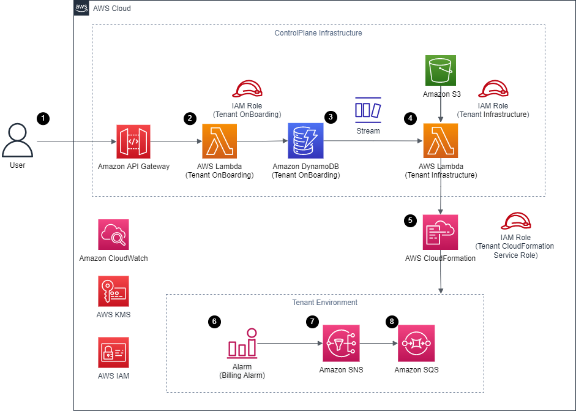

# Tenant onboarding in SaaS Architecture for Silo Model APG Example

This is the code repo for Tenant onboarding in SaaS Architecture for Silo Model APG Pattern

[[_TOC_]]

## Summary
SaaS applications can be built with a variety of different architectural models. The `silo model` refers to an architecture where tenants are provided dedicated resources. SaaS applications rely on a frictionless model for introducing new tenants into their environment. This often requires the orchestration of a number of components to successfully provision and configure all the elements needed to create a new tenant. This process, in SaaS architecture, is referred to as tenant on-boarding. On-boarding should be fully automated for every SaaS environment by utilizing infrastructure as code in your on-boarding process. This pattern guides you through a simple example of on-boarding tenant and provisioning a simplified infrastructure for the tenant upon on-boarding.

## Overall Technology Stack
### Control-plane Technology Stack
THE CDK code written in .NET is used to provision the Control Plane infrastructure consisting of the below resources:

1) API Gateway
2) Tenant on-boarding Lambda function
3) Tenant on-boarding DynamoDb [ with DynamoDb streams enabled]
4) Tenant Infrastructure Lambda function
5) S3 bucket

The “Tenant On-boarding ”Lambda function is triggered from an API Gateway through the POST Method, which results into storing the received info as a record in the DynamoDB table, "Tenant Onboarding" table, with the tenant details. 

Tenant name in this code sample is also used as part of tenant stack name and resources' name within that stack. This is to make these resources easier to identify. This tenant name must be unique across the setup to avoid conflict/error. 

The storing process to the DynamoDB table will only success if the tenant name is not used in any other record in the table. 

The tenant name in this case is the partition key for this table, as the only partition key can be used as an put item condition expression. 

If the tenant name is never recorded before, the record will be saved into the table success. 

However, if the tenant name is already used by an existing record in table, the operation will fail and trigger a DynamoDB ConditionalCheckFailedException exception. The exception will be used to return a failure message to user (HTTP BadRequest) that the tenant name is already used.

The “Tenant On-boarding ”Lambda function can also be triggered from an API Gateway through the DELETE Method, which results received info to be used as a key to remove the associated record from the DynamoDB table, "Tenant Onboarding" table.

The DynamoDB deletion will success in this case no matter if record is found or not in this sample. 

However, only the deletion of an record will create a DynamoDB stream. If deletion does not delete anything, a stream will not be created (therefore downstream Lambda will not be triggered).


The "Tenant Onboarding" DynamoDB Table upon a success record save/deletion will send a stream to downstream AWS Lambda, "Tenant Infrastructure" function. 


The "Tenant Infrastructure" Lambda function will act based on received DynamoDB stream record. If the record is for "INSERT" event, will trigger AWS CloudFormation to create a new tenant infrastructure with the AWS CloudFormation template stored in S3 bucket. If the record is for "REMOVE", will trigger deletion of an existing stack based on the stream record's Tenant Name field.

### Tenant Technology stack
A simple CloudFormation Template is stored in the S3 bucket.

This template provisions tenant specific  KMS Key, CloudWatch Alarm, SNS topic, SQS queue, and SQS policy.

The KMS key is used for data encryption by SNS and SQS for their messages. . The AWS Key Management Service (AWS KMS) for each tenant opens to Amazon CloudWatch/Amazon Simple Notification Service (SNS) services in the account to consume per key management doc. Security Practices (AwsSolutions-SNS2 and AwsSolutions-SQS2) recommend SNS and SQS to be setup with encryption. However, CloudWatch Alarm cannot work with SNS with AWS Managed Key, so KMS CMK must be used in this case.

The SQS policy is used on SQS to allow the created SNS to deliver message to it, otherwise the access will be denied per doc (Step 2 section).

This is a basic template which creates billing alerts using CloudWatch Alarm and notify if the threshold is breached. The SQS queue receives a message from SNS . The message from the SQS queue will then be used by the customer for further processing *(since we are creating a billing alarm it is recommended to deploy the stack in N.Virginia ( us-east-1))



## Overall Flow
Tenant Stack Creation Flow

1. User sends a POST API request with new tenant payload (tenant name, tenant description) in JSON to REST API hosted by Amazon API Gateway, which will process the request and forward to backend AWS Lambda, Tenant Onboarding function. In this sample, there is no authorization/authentication. But in a production setup, this API will be integrated with the SaaS infrastructure security system.
2. The Tenant Onboarding function will verify the request and then attempt to store the tenant record (tenant name, generated tenant UUID, tenant description) into an Amazon DynamoDB table, Tenant Onboarding table. 
3. Once the DynamoDB stores the record, will then pass a DynamoDB stream to trigger downstream AWS Lambda, Tenant Infrastructure Function.
4. The "Tenant Infrastructure" Lambda function will act based on received DynamoDB stream. If the stream is for "INSERT" event, will use the stream's NewImage (latest update record, Tenant Name field) section to trigger AWS CloudFormation to create a new tenant infrastructure with the AWS CloudFormation template stored in S3 bucket and parameter specific to the tenant (in this case, it is Tenant Name). 
5. AWS CloudFormation will create the tenant infrastructure based on the CloudFormation template and input parameters
6. Each tenant infrastructure setup will have a CloudWatch Alarm, Billing Alarm, which will be triggered when tenant infrastructure cost is above 100 dollars (in this sample). Once an alarm is triggered, will access AWS KMS for encryption key to send message to downstream SNS topic.
7. SNS Topic upon received the message will access AWS KMS for encryption key and place the message within downstream SQS queue.
8. SQS queue in this case can be integrated with other system to perform action based on received message. In this sample, there is no action taken to keep the code generic and simple.


Tenant Stack Deletion Flow

1. User sends a DELETE API request with new tenant payload (tenant name, tenant description) in JSON to REST API hosted by Amazon API Gateway, which will process the request and forward to Tenant Onboarding function. In this sample, there is no authorization/authentication. But in a production setup, this API will be integrated with the SaaS infrastructure security system.
2. The Tenant Onboarding function will verify the request and then attempt to delete the tenant record (tenant name) from the Tenant Onboarding table. 
3. Once the DynamoDB delete the record success (the record exists in the table and is deleted), will then pass a DynamoDB stream to trigger downstream AWS Lambda, Tenant Infrastructure Function.
4. The "Tenant Infrastructure" Lambda function will act based on received DynamoDB stream record. If the stream is for "REMOVE" event, will use the record's OldImage (record info, Tenant Name field, before the latest change, which is delete) section to trigger deletion of an existing stack based on the stream record's Tenant Name field.
5. AWS CloudFormation will delete the target tenant stack according to input

## Prerequisites 
1. An Active AWS Account. (See [AWS Account](https://aws.amazon.com/account/) Page.)
2. AWS CDK ToolKit Installed. (See [AWS CDK Toolkit](https://docs.aws.amazon.com/cdk/v2/guide/cli.html) in the AWS CDK documentation.) 
3. User with sufficient access to create AWS resources for this pattern.(See IAM role in [AWS IAM Roles](https://docs.aws.amazon.com/IAM/latest/UserGuide/id_roles.html) Documentation.)
4. User should have programmatic access keys.(See [IAM user and Access](https://docs.aws.amazon.com/IAM/latest/UserGuide/id_users_create.html) in the AWS IAM documentation.)
5. Amazon command line interface (AWS CLI). (See [Installing, updating, and uninstalling the AWS CLI](https://docs.aws.amazon.com/cli/latest/userguide/getting-started-install.html) in the AWS CLI documentation.)
6. [Download](https://visualstudio.microsoft.com/downloads/) and install Visual Studio 2022 OR [Download](https://code.visualstudio.com/download) and install Visual Studio Code.
7. Setup the AWS Toolkit for Visual Studio. Instructions are [available here](https://docs.aws.amazon.com/toolkit-for-visual-studio/latest/user-guide/setup.html).
8. C# AWS CDK applications require .NET Core v3.1 or later, [available here](https://dotnet.microsoft.com/en-us/download/dotnet/3.1).
9. Install [Amazon.Lambda.Tools](https://github.com/aws/aws-extensions-for-dotnet-cli#aws-lambda-amazonlambdatools).

## Limitations
The sample code is acting as a high-level implementation, following should be addressed within actual implementation for production setup:

1. AWS CDK uses [AWS CloudFormation](https://aws.amazon.com/cloudformation/), AWS CDK applications are subject to CloudFormation service quotas. For more information, see AWS CloudFormation quotas. 

2. The [AWS Simple Cloud Storage (S3)](https://aws.amazon.com/s3/) bucket in this sample does not have versioning enable to keep the sample simple. Please evaluate and update the setup as needed.

3. The [Amazon API Gateway](https://aws.amazon.com/api-gateway/) REST API endpoints without authentication/authorization/throttling to keep this code simple and generic. It is assumed users will integrate the system with the business security infrastructure. Please evaluate this setting and add required security settings as needed.

4. This sample setups [Amazon Simple Notification Service (SNS)](https://aws.amazon.com/sns/)/[Amazon Simple Queue Service (SQS)](https://aws.amazon.com/sqs/) setup per tenant infrastructure only has a minimum setup. The [AWS Key Management Service (AWS KMS)](https://aws.amazon.com/kms/) for each tenant opens to [Amazon CloudWatch](https://aws.amazon.com/cloudwatch/)/Amazon Simple Notification Service (SNS) services in the account to consume per [Key management](https://docs.aws.amazon.com/AWSSimpleQueueService/latest/SQSDeveloperGuide/sqs-key-management.html#compatibility-with-aws-services). The setup is only act as a place holder sample. Please adjust with business use case as needed.

5. The entire setup, which includes but not limits to API endpoints/backend tenant [AWS CloudFormation](https://aws.amazon.com/cloudformation/) provision and deletion, only covers the basic happy path case. Please evaluate and updated the setup with necessary retry logics, additional error handling logics, and security logics based on business need.

6. The backend Lambda role currently use `AdministratorAccess` AWS Managed policy in order to provision the AWS CloudFormation stack for each tenant infrastructure. This is for development only. For production use case, please evaluate this setting and provide only required access to this Lambda role (i.e. limit the creation access only to required infrastructure within each tenant AWS CloudFormation stack).

7. The sample code is tested with up to date cdk-nag [cdk-nag](https://github.com/cdklabs/cdk-nag) to check for policies at time of the written. It is possible there maybe new policies enforced in future. These new policies may require users to manual modify the stack per recommendation before the stack can be deployed. Please also review the existing code to ensure it aligns with users' business requirement.

8. The stack deletion process will not clean up CloudWatch Logs (Log Groups/Logs) generated by the stack. So will require users to manually clean up either through AWS CloudWatch console/API.

9. The code relies on CDK to generate random suffix instead of relying on static assigned physical name for most created resources. This setup is to ensure these resources are unique and not conflict with other stack as per [CDK Doc (under Physical names section)](https://docs.aws.amazon.com/cdk/v2/guide/resources.html). Please adjust per business requirement.

## Deploy / Clean up
Deploy this stack to your default AWS account/region (assume [AWS CDK](https://aws.amazon.com/cdk/) 2.1.0 or later installed)

1. Deploy the stack
In the Git repo, open a new terminal with AWS Credential configured and point to correction region, please enter following to deploy the stack
```
cdk deploy
```
Confirm the created stack is in correct account and IAM roles preview, then press y to confirm.

Please monitor the creation process and save the output record
```
Outputs:
TenantOnboardingInfraStack.TenantOnboardingAPIEndpoint42E526D7 = https://j2qmp8ds21i1i.execute-api.us-west-2.amazonaws.com/prod/
```

2. Test tenant creation
Please send following request to create a new tenant (after replace `<TenantOnboardingAPIEndpoint* from CDK Output>` with actual value)
```
curl -X POST <TenantOnboardingAPIEndpoint* from CDK Output>tenant -d '{"Name":"Tenant123", "Description":"Stack for Tenant123"}'
```

Example:
```
curl -X POST https://j2qmp8ds21i1i.execute-api.us-west-2.amazonaws.com/prod/tenant -d '{"Name":"Tenant123", "Description":"test12"}'
```

After the provision is completed, a message like below will respond back if the invocation successes:
```
{  "message": "A new tenant added - 5/4/2022 7:11:30 AM" }
```
Please check the AWS CloudFormation console, a stack with above tenant name (i.e. `Tenant123`) is created.

3. Test tenant infrastructure
From AWS CloudFormation console -> Click on the newly created tenant cluster -> Resources -> Note the alarm resource name

Open a new terminal with AWS Credential configured and point to correction region, please enter following (after replace `<alarm resource name>` with above alarm resource name) to raise a dummy alarm
```
aws cloudwatch set-alarm-state --alarm-name <alarm resource name> --state-value ALARM --state-reason 'Test setup'
```

Example
```
aws cloudwatch set-alarm-state --alarm-name tenant123-Topic --state-value ALARM --state-reason 'Test setup'
```

From AWS CloudFormation console -> Click on the newly created tenant cluster -> Resources -> Note the SQS resource name
From AWS SQS console -> Click on the SQS resource from above -> Following the [AWS Doc](https://docs.aws.amazon.com/AWSSimpleQueueService/latest/SQSDeveloperGuide/sqs-using-receive-delete-message.html) to receive and delete the test message from the alarm test.

4. Test tenant deletion
Please send following request to delete an existing enant (after replace `<TenantOnboardingAPIEndpoint* from CDK Output>` with actual value). The `Tenant123` is based on input on #3, if a different value is used, please adjusted as needed.

```
curl -X DELETE <TenantOnboardingAPIEndpoint* from CDK Output>tenant/Tenant123
```

Example:
```
curl -X DELETE https://j2qmp8ds21i1i.execute-api.us-west-2.amazonaws.com/prod/tenant/Tenant123
```
After the provision is completed, a message like below will respond back if the invocation successes:
```
{ "message": "Tenant destroyed - 5/4/2022 7:14:48 AM"}
```
Please check the AWS CloudFormation console, the stack with above tenant name  (i.e. `Tenant123`) will be deleted (either is already deleted or the deletion is in progress)

5. [Optional] Clean up the deployed setup

Before the stack clean up, please ensure following:
- All records in DynamoDB are removed either through above tenant deletion API, or through DynamoDB Console/API. Each tenant record deletion will trigger clean up of its AWS CloudFormation counterpart. 
- All tenant based AWS CloudFormations are clean up (in case somehow the DynamoDB trigger clean up logic fail to clean up) in AWS CloudFormation console/API.

In the Git repo, open a new terminal with AWS Credential configured and point to correction region, please enter following to destroy the stack
```
cdk destroy
```     
Confirm to delete the stack to proceed with the deletion

6. [Optional] Clean up [AWS CloudWatch Log](https://docs.aws.amazon.com/AmazonCloudWatch/latest/logs/WhatIsCloudWatchLogs.html)
The stack deletion process will not clean up CloudWatch Logs (Log Groups/Logs) generated by the stack. So will require user to manually clean up either through AWS CloudWatch console/API.

## Additional Notes about CDK-NAG/CFN-NAG

This sample's CDK and Cloudformation codes are scanned with CFN-NAG and CDK-NAG. Below is the overall setup of the process for reference.

The setup is already done, so no need to re-do on this repo unless for library update (cdk-nag library) or re-scan of cfn-nag (the cdk-nag rescan will happen automatically on every` cdk synth`/`cdk deploy` command with the current setup).

### CFN-NAG Installation/Handling for Pure CloudFormation file

This code sample contains a cloudformation template used for tenant infrastructure setup. So is scanned with [CFN-NAG](https://github.com/stelligent/cfn_nag) for inspection.

Please go to [CFN-NAG offical site](https://github.com/stelligent/cfn_nag) for latest up to date procedures on the installation.

There are two procedures for installing according to the doc as of this written., one is as Ruby Gem pakcage, another one is through Brew

Below will use the Ruby Gem procedure.

Install Ruby from the [official website](https://www.ruby-lang.org/en/documentation/installation/). If on Windows, one recommendation is to use `ruby-installer` list on the site.

Once ruby and gem (gem should come default as part of ruby installation) are installed, please run following on a terminal to install `cfn-nag`
```
gem install cfn-nag
```

Then on the `<git repo>`, please run
```
cfn_nag_scan --input-path template/infra.yaml
```

The result will indicate possible setup warning with the template (note, the scan is done with CFN-NAG's default policy setup, may need to adjust base on each users' preferences).

Note this code sample did have one warning with static name. The reason to not resolve this particular warning is to simplify the identification of each tenant resource alarm. But if it does not fulfill users' use cases, please adjust the CloudFormation template as needed.

Example output:
```
cfn_nag_scan --input-path template/infra.yaml
------------------------------------------------------------
template/infra.yaml
------------------------------------------------------------------------------------------------------------------------
| WARN W28
|
| Resource: ["BillingAlarm"]
| Line Numbers: [54]
|
| Resource found with an explicit name, this disallows updates that require replacement of this resource

Failures count: 0
Warnings count: 1
```

### CDK-NAG Installation/Handling for .NET CDK

[CDK-NAG](https://github.com/cdklabs/cdk-nag) is written in TypeScript. It did publish .NET library to work with CDK in .NET, however, most documentation is implemented through TypeScript/Python on the official sites/other sites.

Following is a procedure after reverse engineer through TypeScript documentations and source code. Note all steps will need to be followed for the CDK-NAG to inspect the stack.

#### CDK-NAG Library Installation Into CDK .NET Code

Move to `<git repo>/src/TenantOnboardingInfra/` (CDK infrastructure code's csproj folder location), then please enter following to install the cdk [latest library](https://www.nuget.org/packages/Cdklabs.CdkNag)
```
dotnet add package Cdklabs.CdkNag --version 2.13.1
```

Once complete, the csproj dependency should be updated to inject a new cdk-nag library. 

Example below
```
    <!-- CDK Construct Library dependencies -->
    <PackageReference Include="Amazon.CDK.Lib" Version="2.21.1" />
    <PackageReference Include="Cdklabs.CdkNag" Version="2.12.43" />
    <PackageReference Include="Constructs" Version="[10.0.0,11.0.0)" />
```

However, at time of this written, the default installation will cause a library conflict. CDK library requires AWS Constructs library equal to or above `10.0.0` (i.e. as shown in example `[10.0.0,11.0.0)`), but CDK-NAG requires AWS Constructs library equal to or above `10.0.5` or above (i.e. as shown in example `[10.0.5,11.0.0)`)

This caused the code to error out during building with error message 
```
ERROR: ... Constructs library is updated to 10.0.5 unexpected etc...
```

The reason is CDK library try to pull `10.0.0` as the minimum, while CDK-NAG try to pull `10.0.05`, the two versions of library eventually caused a race condition conflict and fail the build.

The fix is to manually adjust `<git repo>/src/TenantOnboardingInfra/TenantOnboardingInfra.csproj` file to fix in way that satisfy both library (which is to be `10.0.5` or above)
```
    <!-- CDK Construct Library dependencies -->
    <PackageReference Include="Amazon.CDK.Lib" Version="2.21.1" />
    <PackageReference Include="Cdklabs.CdkNag" Version="2.12.43" />
    <PackageReference Include="Constructs" Version="[10.0.5,11.0.0)" />
```

In the folder contain .csproj, (1) delete the obj folder and then (2) perform following command
```
dotnet restore
```

This will force the project to resync the dependency and should remove the conflict library and leave only `10.0.5`.

#### CDK-NAG Aspect Setup for CDK .NET Code

Open `<git repo>/src/TenantOnboardingInfra/Program.cs`) in Visual Studio/Visual Studio Code.

This file is the entry, which contain the Main function, for the CDK infrastructure code setup

Add one additional namespace
```
using Cdklabs.CdkNag;
...
```

Then before the sync command, add the `Aspects` portion like below before `app.Synth();`

The reason it need to be before app.Synth(); command is because the CDK-NAG is perform through Apsect step within entire CDK setup to inspect the infrastructure. If done after Synth command, then as the Synth and entire stack is complete build, CDK cannot analyze result.

Detail explanation can be found in this (doc)[https://aws.amazon.com/blogs/devops/align-with-best-practices-while-creating-infrastructure-using-cdk-aspects/]
```
       public static void Main(string[] args)
        {
            var app = new App();
            new TenantOnboardingInfraStack(app, "TenantOnboardingInfraStack", new StackProps
...

            // CDK-Nag must be present before app synth to inject check, otherwise the CDK Nag aspect will be ignored
            // https://aws.amazon.com/blogs/devops/align-with-best-practices-while-creating-infrastructure-using-cdk-aspects/
            Aspects.Of(app).Add(new AwsSolutionsChecks(new NagPackProps{Verbose = true}));

            app.Synth();
        }
```

If now trying to do following command in `<git repo>` folder
```
cdk synth
```

will result some errors shown in the [cdk-nag doc’s screen capture](https://github.com/cdklabs/cdk-nag) (note this code base should not procedue any error as all errors are resolved/suppressed)

Example below
```
cdk synth
[Error at /TenantOnboardingInfraStack/Custom::CDKBucketDeployment8693BB64968944B69AAFB0CC9EB8756C/ServiceRole/DefaultPolicy/Resource] AwsSolutions-IAM5[Action::s3:GetBucket]: The IAM entity contains wildcard permissions and does not have a cdk_nag rule suppression with evidence for those permission. Metadata explaining the evidence (e.g. via supporting links) for wildcard permissions allows for transparency to operators. This is a granular rule that returns individual findings that can be suppressed with 'appliesTo'. The findings are in the format 'Action::<action>' for policy actions and 'Resource::<resource>' for resources. Example: appliesTo: ['Action::s3:'].
...
[Error at /TenantOnboardingInfraStack/tenant-onboarding-infra-bucket-tw/Policy/Resource] AwsSolutions-S10: The S3 Bucket or bucket policy does not require requests to use SSL. You can use HTTPS (TLS) to help prevent potential attackers from eavesdropping on or manipulating network traffic using person-in-the-middle or similar attacks. You should allow only encrypted connections over HTTPS (TLS) using the aws:SecureTransport condition on Amazon S3 bucket policies.
```

IMPORTANT: If cdk synth error out due to unresolved CDK-NAG errors, cdk deploy command will also fail. Ts the inspect and block is at Aspect level within CDK process. The error at Aspect step will block entire CDK generation process and fail the deployment.

Some of errors can be done through updating the setting within CDK code.
For example, for this S3 set up error
```
[Error at /TenantOnboardingInfraStack/tenant-onboarding-infra-bucket-tw/Policy/Resource] AwsSolutions-S10: The S3 Bucket or bucket policy does not require requests to use SSL.
```
The fix is to update the setting in CDK infrastructure code to enforce SSL

In `<git repo>/src/TenantOnboardingInfra/TenantOnboardingInfraStack.cs`
```
            // Create an S3 bucket
            // Not specify a bucket name to let CDK auto generated suffix to append to resource name to make unique bucket name
            var bucket = new Bucket(this, "tenant-onboarding-infra-bucket-tw", new BucketProps
            {
                Encryption = BucketEncryption.S3_MANAGED,
                RemovalPolicy = RemovalPolicy.DESTROY,
                AutoDeleteObjects = true,
                EnforceSSL = true,
                PublicReadAccess = false,
                BlockPublicAccess = BlockPublicAccess.BLOCK_ALL,            // Block all public access by default (only ACL or IAM)
                ServerAccessLogsPrefix = "TenantOnboardingBucketAccessLog"  // Enable access log AwsSolutions-S1
            });
```

But for some error, this may result from CDK’s auto generated code, need to use Supress logic to do it. For example, below CDK-NAG error is due to it detects the CDKBucketDeployment constructor is setting a IAM policy with wildcard Action/Resource (S3*).

But this is auto generated by CDK’s default constructor CDKBucketDeployment .  So it is hard to change, and the reason BucketDeployment did this is due to CDK S3 resource maybe created at same time, so there will be a circular dependency condition if want to target specific resource. This is also used only for deployment, not production running code
```
[Error at /TenantOnboardingInfraStack/Custom::CDKBucketDeployment8693BB64968944B69AAFB0CC9EB8756C/ServiceRole/DefaultPolicy/Resource] AwsSolutions-IAM5[Action::s3:GetBucket]: The IAM entity contains wildcard permissions and does not have a cdk_nag rule suppression with evidence for those permission.... Example: appliesTo: ['Action::s3:'].
```
So in this case, we will update CDK infrastructure code to suppress above as business justification, note, as this is Custom Resource at stack level, will need to use stack suppression like below NagSuppressions.
```
AddStackSuppressions(
```

Example below did suppressions for two codes at stack level in `<git repo>/src/TenantOnboardingInfra/TenantOnboardingInfraStack.cs`

Need to add additional namespace to use the library.
```
...
using Cdklabs.CdkNag;
...     
```
Then in stack class, did following

```
    public class TenantOnboardingInfraStack : Stack
    {
...
            // Enable adding suppressions to AwsSolutions-IAM4 to notify CDK-NAG that 
            // The S3 wildcard IAM policy is auto generated by CDK as part S3 deployment constructor
            // This need to be at stack level due to that custom resource is a random generated id, so cannot be fetch or supress by path directly
            // Example /TenantOnboardingInfraStack/Custom::CDKBucketDeployment8693BB64968944B69AAFB0CC9EB8756C/ServiceRole/DefaultPolicy/Resource
            NagSuppressions.AddStackSuppressions(
              this,
              new[]{
                new NagPackSuppression{Id = "AwsSolutions-IAM4", Reason = "This lambdaExecutionRole used recommended policies from https://docs.aws.amazon.com/lambda/latest/dg/lambda-intro-execution-role.html. For the administrator access policy, it is outline in README that user should restrict the access according to their business need."},
                new NagPackSuppression{ Id = "AwsSolutions-IAM5", Reason = "This wildcard permission on ['Action::s3:*'] comes from AWS CDK auto generated policy to enable auto deployment of S3 resources" },
              },
              true
            );
```

The other type of suppression is at resource level with NagSuppressions.AddResourceSuppressions. Below example will add suppression to the generated IAM role, as the AWS Managed Lambda Role is a recommendation according to AWS official guide.
```
....
            // Create tenantOnboardingFunctionExecutionRole Lambda execution role
            Role tenantOnboardingFunctionExecutionRole = new Role(this, tenantOnboardingFuncName + "-execution-role", new RoleProps
            {
                AssumedBy = new ServicePrincipal("lambda.amazonaws.com")
            });

            // Add required lambda policies
            // These polices according to documentation https://docs.aws.amazon.com/lambda/latest/dg/lambda-intro-execution-role.html are recommended to use over manually add policy. As Lambda will need to access random cloudwatch/XRAY endpoint base on input requirement
            tenantOnboardingFunctionExecutionRole.AddManagedPolicy(ManagedPolicy.FromAwsManagedPolicyName("service-role/AWSLambdaBasicExecutionRole"));

            // Addd READ/WRITE access to DynamoDB table
            tenantTable.GrantReadWriteData(tenantOnboardingFunctionExecutionRole); 
            
            // Enable adding suppressions to AwsSolutions-IAM4 to notify CDK-NAG that 
            // This role used required AWS Managed Lambda policies. These polices according to documentation https://docs.aws.amazon.com/lambda/latest/dg/lambda-intro-execution-role.html are recommended to use over manually add policy. As Lambda will need to access random cloudwatch/XRAY endpoint base on input requirement
            // The wildcard is coming from AWS Managed Lambda policy due to how Lambda dynamically create cloudwatch/xray setup on start up
            NagSuppressions.AddResourceSuppressions(
              tenantOnboardingFunctionExecutionRole, new[]{
                new NagPackSuppression{ Id= "AwsSolutions-IAM4", Reason= "This lambdaExecutionRole used recommended policies from https://docs.aws.amazon.com/lambda/latest/dg/lambda-intro-execution-role.html." },
                new NagPackSuppression{ Id= "AwsSolutions-IAM5", Reason= "This wildcard permission comes from AWS Managed Lambda policies for cloudwatch/xray, which is required as lambda cannot control cloudwatch log group name in advance and require wildcard permission to create on fly so cannot be replaced" }
              },
              true
            );
            
...
```

Please repeat above steps until
``
cdk synth
```
is producing normal cdk synth result, which indicate there is no more error to be found.
